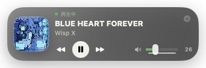

# SpotifyControl

<p align="center">
  
</p>

A tiny, always-on-top Spotify controller for macOS.

SpotifyControl keeps album artwork, track information, playback controls, and
Spotify volume available in a compact glass overlay across Spaces and full-screen
apps. It talks directly to the installed Spotify desktop app through Apple Events;
no Spotify developer account or Web API credentials are required.

> SpotifyControl is an independent, unofficial project. It is not affiliated with
> or endorsed by Spotify AB. Spotify and the Spotify logo are trademarks of their
> respective owners.



## Features

- Always-on-top overlay that can appear across Spaces and full-screen apps
- Current album artwork, track title, and artist
- Previous, play/pause, and next controls
- Spotify app volume control
- Remembers the overlay position between launches
- Prevents duplicate widget processes when launched repeatedly
- Compact translucent macOS-native interface
- No analytics, accounts, or bundled credentials

## Requirements

- macOS 13 Ventura or later
- [Spotify for macOS](https://www.spotify.com/download/mac/)
- Xcode Command Line Tools when building from source

## Build and run

```bash
cd SpotifyControl
./Scripts/package-app.sh release
open build/SpotifyControl.app
```

Run these commands after cloning or downloading the repository. The release
command produces:

- `build/SpotifyControl.app`

The app is built for the architecture of the Mac running the command and is
ad-hoc signed for local use. This repository currently distributes source code,
not a notarized binary release. A future downloadable build must be signed with a
Developer ID certificate and notarized before publication.

## First-launch permission

When Spotify is running, macOS asks whether SpotifyControl may control Spotify.
Choose **Allow**. If access was denied:

1. Open **System Settings**.
2. Go to **Privacy & Security > Automation**.
3. Enable Spotify under SpotifyControl.

You can also right-click the overlay and choose **オートメーション設定を開く**.

Changing the bundle identifier or rebuilding under a different identity can cause
macOS to request this permission again.

## Usage

- Drag the glass background to reposition the overlay.
- Right-click for Spotify, Automation settings, and Quit actions.
- Use the close button in the upper-right corner to quit.
- If Spotify is closed, pressing Play launches it in the background and resumes
  playback.

## Privacy

SpotifyControl has no telemetry and sends no usage data to the developer. Playback
state and controls stay on the Mac through Apple Events. Album artwork is loaded
from the artwork URL supplied by the Spotify desktop app.

## Development

```bash
swift build
swift test
./Scripts/package-app.sh debug
```

See [CONTRIBUTING.md](CONTRIBUTING.md) for contribution guidelines.

## Known limitations

- The Spotify desktop app must be installed.
- SpotifyControl controls Spotify's own volume, not the macOS system volume.
- Playback position, shuffle, repeat, and playlist browsing are not currently
  exposed.
- Apple Events calls are serialized and limited to three seconds; the first
  macOS permission prompt can still briefly delay a refresh.

## License

SpotifyControl is available under the [MIT License](LICENSE).

---

## 日本語

SpotifyControlは、Spotifyの曲情報・再生操作・音量を、ほかのアプリや
フルスクリーン表示の上から操作できる小型macOSオーバーレイです。
Spotify Web APIやAPIキーは不要で、macOSのApple Eventsを使ってローカルの
Spotifyアプリだけを操作します。
