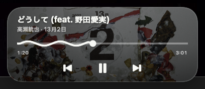

# SpotifyControl

<p align="center">
  
</p>

A tiny, always-on-top Spotify controller for macOS.

SpotifyControl keeps album artwork, track information, playback progress, and
playback controls available in a compact glass overlay across Spaces and full-screen
apps. It talks directly to the installed Spotify desktop app through Apple Events;
no Spotify developer account or Web API credentials are required.

> SpotifyControl is an independent, unofficial project. It is not affiliated with
> or endorsed by Spotify AB. Spotify and the Spotify logo are trademarks of their
> respective owners.



## Features

- Always-on-top overlay that can appear across Spaces and full-screen apps
- Static full-bleed album artwork with track, artist, and album information
- Animated liquid-ribbon progress with elapsed time, duration, and seeking
- Previous, play/pause, and next controls
- Continuous bottom-right resizing from an unobtrusive 55% scale to 135%
- Remembers the overlay position between launches
- Prevents duplicate widget processes when launched repeatedly
- Compact translucent macOS-native interface
- No analytics, accounts, or bundled credentials

## Requirements

- macOS 13 Ventura or later
- [Spotify for macOS](https://www.spotify.com/download/mac/)
- Xcode Command Line Tools when building from source

## Download

Download the Apple silicon build from the
[latest GitHub release](https://github.com/Unleash26/SpotifyControl/releases/latest).
The published app is signed with a Developer ID certificate and notarized by
Apple. Move `SpotifyControl.app` to Applications, then open it normally.

## Build and run

```bash
cd SpotifyControl
./Scripts/package-app.sh release
open build/SpotifyControl.app
```

Run these commands after cloning or downloading the repository. The release
command produces:

- `build/SpotifyControl.app`

The app is built for the architecture of the Mac running the command and is
ad-hoc signed for local development. The downloadable GitHub release is built
separately with a Developer ID signature and Apple notarization.

## First-launch permission

When Spotify is running, macOS asks whether SpotifyControl may control Spotify.
Choose **Allow**. If access was denied:

1. Open **System Settings**.
2. Go to **Privacy & Security > Automation**.
3. Enable Spotify under SpotifyControl.

You can also right-click the overlay and choose **オートメーション設定を開く**.

Changing the bundle identifier or rebuilding under a different identity can cause
macOS to request this permission again.

## Usage

- Drag the glass background to reposition the overlay.
- Drag the liquid-ribbon timeline to seek within the current track.
- Drag the small handle at the lower-right corner to resize the complete overlay
  continuously. Its aspect ratio and top-left position stay fixed, and the exact
  size is restored on the next launch.
- Right-click for Spotify, Automation settings, and Quit actions.
- Use the close button in the upper-right corner to quit.
- If Spotify is closed, pressing Play launches it in the background and resumes
  playback.

## Privacy

SpotifyControl has no telemetry and sends no usage data to the developer. Playback
state and controls stay on the Mac through Apple Events. Album artwork is loaded
from the artwork URL supplied by the Spotify desktop app.

## Development

```bash
swift build
swift test
./Scripts/package-app.sh debug
```

See [CONTRIBUTING.md](CONTRIBUTING.md) for contribution guidelines.

## Known limitations

- The Spotify desktop app must be installed.
- SpotifyControl controls Spotify's own volume, not the macOS system volume.
- Shuffle, repeat, and playlist browsing are not currently exposed.
- Apple Events calls are serialized and limited to three seconds; the first
  macOS permission prompt can still briefly delay a refresh.

## License

SpotifyControl is available under the [MIT License](LICENSE).

---

## 日本語

SpotifyControlは、Spotifyの曲情報・再生位置・再生操作を、ほかのアプリや
フルスクリーン表示の上から操作できる小型macOSオーバーレイです。
Spotify Web APIやAPIキーは不要で、macOSのApple Eventsを使ってローカルの
Spotifyアプリだけを操作します。
